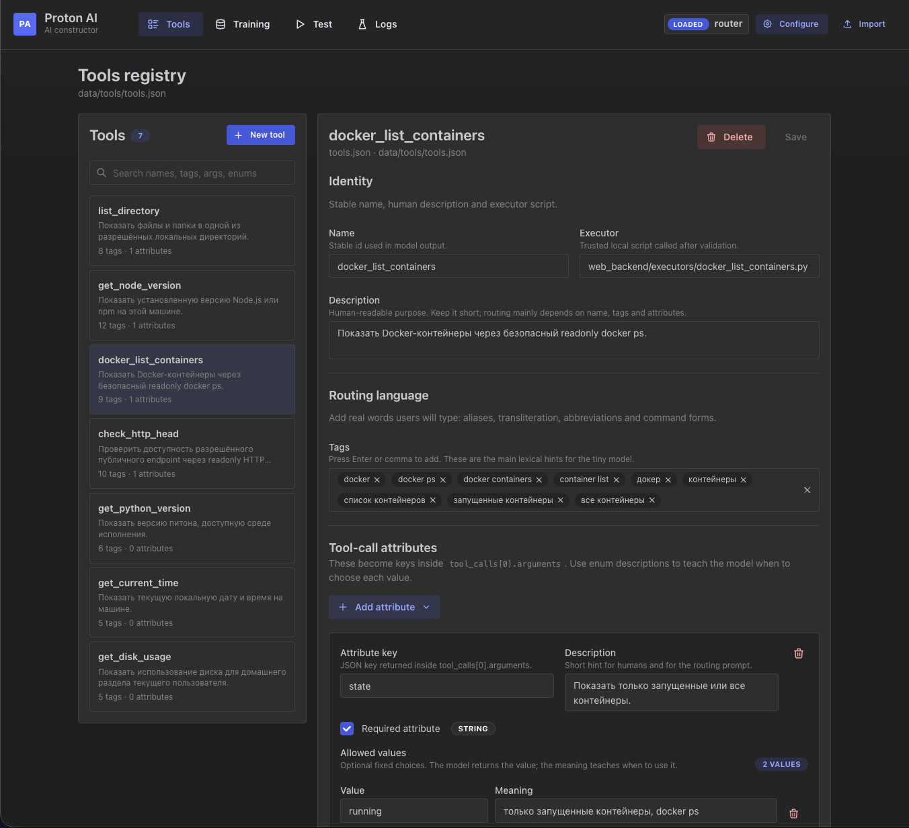
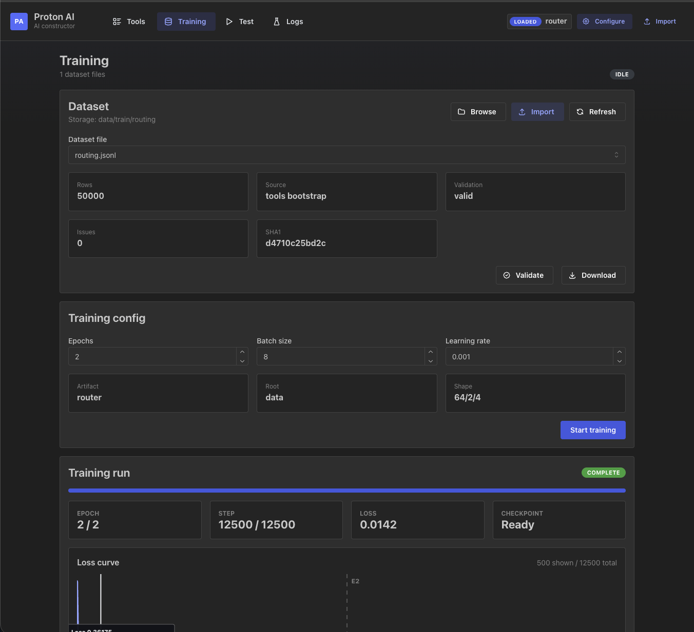
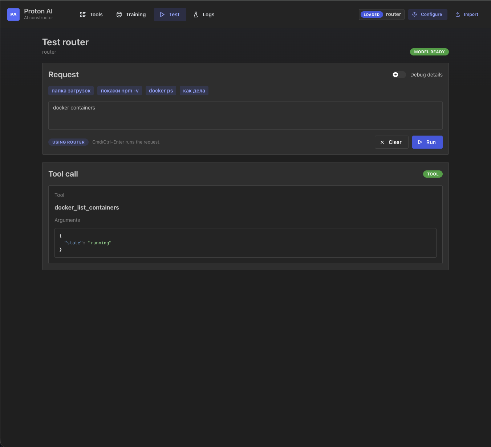
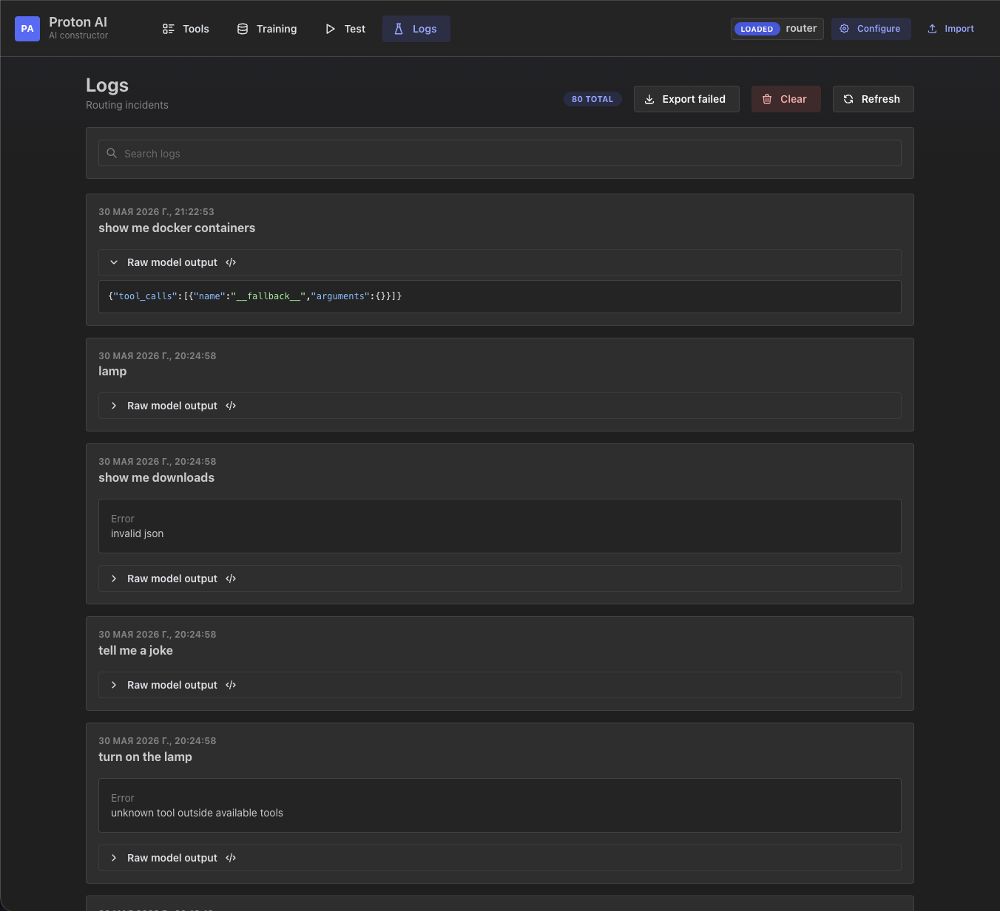

# Proton AI

Proton AI is an AI constructor for small local models with tool-calling support. It provides a ready environment for development and testing. Behavior is defined by the dataset: it can be a tool-call router, an AI model for any game, a small dialogue model, a classifier, or another specialized local scenario.

Russian documentation: [README.ru.md](README.ru.md)

## Included Tool-Calling Workflow

```text
tools registry + user_text -> tool_calls JSON
```

Example tool call:

```json
{"tool_calls":[{"name":"get_current_time","arguments":{}}]}
```

Fallback is also a structured tool call:

```json
{"tool_calls":[{"name":"__fallback__","arguments":{}}]}
```

The general product loop is:

```text
define task -> build dataset -> train model -> test -> inspect logs -> improve dataset
```

## Why This Exists

Small local models often need the same product shell around them: a dataset format, training commands, model artifact management, a test surface, logs, and a way to improve the next dataset. Proton AI packages that loop into a local constructor instead of leaving every project to rebuild the same infrastructure.

The bundled tool-calling example is useful when the output must be a structured action rather than free-form text:

- local automation commands;
- internal API operation selection;
- classification into allowed actions;
- script orchestration with validated arguments;
- small offline routers for a fixed tool set.

## Architecture

```text
service/      FastAPI model service: routing, validation, dataset build, training
web_backend/  FastAPI UI backend: workspace, tools, datasets, execution, logs
web_ui/       React/Vite web UI
web/          retired Streamlit UI kept for compatibility
data/         local tools, datasets, weights, tokenizers, logs, workspace state
repo_docs/    tracked project documentation in English and Russian
```

The Python package is still named `protonx` internally. The public project name is `Proton AI`, and the repository slug is `proton-ai`.

## Requirements

- Python 3.11 or 3.12 recommended
- Node.js 18+ with npm
- macOS, Linux, or another environment supported by PyTorch

Use a virtual environment for Python dependencies:

```bash
python3.11 -m venv .venv
source .venv/bin/activate
python -m pip install --upgrade pip
python -m pip install -r service/requirements.txt
python -m pip install -r web_backend/requirements.txt
python -m pip install -r requirements-dev.txt
(cd web_ui && npm install)
```

If your machine uses another Python command, keep the same interpreter for install, tests, and `uvicorn`.

## Run Locally

Start all local processes:

```bash
make run-dev
```

Or run them separately:

```bash
make run-service
make run-ui-backend
make run-web-ui
```

Local URLs:

- `http://127.0.0.1:8000/health` - model service
- `http://127.0.0.1:8100/health` - UI backend
- `http://localhost:8501` - web UI

The web UI currently includes pages for the bundled tool-calling workflow:

- **Tools** - edit the tools registry and executor paths.
- **Training** - import or generate datasets, validate them, and start training.
- **Test** - run user text through the selected model and inspect validation/execution output.
- **Logs** - inspect routing incidents and export failed cases into dataset drafts.

## Screenshots

| Tools | Training |
| --- | --- |
|  |  |
| Tool registry, arguments, allowed values, and executors. | Dataset selection, training settings, run status, and loss curve. |

| Test | Logs |
| --- | --- |
|  |  |
| User request test with the resulting structured tool call. | Failed routing cases with raw model output for dataset improvement. |

## Build The Example Router

1. Add tools in the **Tools** page or edit `data/tools/tools.json`.
2. Use safe, trusted `executor_path` values.
3. Open **Training** and choose the dataset storage folder.
4. Import a compact JSONL dataset or generate a bootstrap dataset from the tools registry.
5. Train a new model.
6. Test real requests on the **Test** page.
7. Use **Logs** to find missing phrases, aliases, argument values, and fallback cases.

Compact JSONL row:

```json
{
  "tools": [
    {"name":"get_current_time","tags":["time","date"]},
    {"name":"__fallback__","tags":["fallback","no tool"]}
  ],
  "user": "what time is it",
  "assistant": {
    "tool_calls": [{"name":"get_current_time","arguments":{}}]
  }
}
```

## Environment Variables

`PROTON_AI_*` variables are the public names. Older `PROTONX_*` names still work for compatibility.

| Variable | Purpose | Default |
| --- | --- | --- |
| `PROTON_AI_TOOLS_FILE` | tools registry file | `data/tools/tools.json` |
| `PROTON_AI_DATASET_DIR` | dataset storage folder | `data/train/routing` |
| `PROTON_AI_ROUTER_LOG_FILE` | router log JSONL file | `data/logs/router.jsonl` |
| `PROTON_AI_WORKSPACE_FILE` | UI workspace settings file | `data/workspace/settings.json` |
| `PROTON_AI_SERVICE_URL` | model service URL used by UI backend | `http://127.0.0.1:8000` |
| `PROTON_AI_TRAIN_DEVICE` | training device override | `cpu` |
| `PROTON_AI_TRAIN_STATE_PATH` | training status file | `data/workspace/training_state.json` |

## Verification

```bash
python -m pytest --import-mode=importlib service/tests web_backend/tests -q
(cd web_ui && npm run build)
```

The long synthetic dataset tests are useful before changing dataset generation logic, but they are not required for routine UI/backend edits.

## Publishing Notes

For a public release, keep generated state out of git:

- `data/train/*`
- `data/weights/*`
- `data/tokenizers/*`
- `data/tools/*`
- `data/logs/*`
- `data/workspace/settings.json`

Tracked examples and `.gitkeep` files are kept so the expected local directory structure is visible.

## Documentation

- [Documentation index](repo_docs/README.md)
- [English guides](repo_docs/en/README.md)
- [Russian guides](repo_docs/ru/README.md)
- [Project concept](PROJECT_CONCEPT.md)
- [Service reference](service/README.md)
